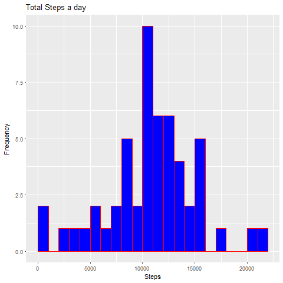

```r
---
title: "PA1_template.Rmd"
author: "MJM Beuken"
date: "1 oktober 2017"
output: html_document
---
```

```
## Error: <text>:8:0: unexpected end of input
## 6: ---
## 7: 
##   ^
```
{r, echo=TRUE, results='hide', warning=FALSE, message=FALSE}

library(ggplot2)
library(dplyr)
library(lubridate)
```

## Getting and cleaning the data
#### Loading to csv and getting rit of quotation marks

```r
setwd('./Data science cursus coursera/course5week2')
```

```
## Error in setwd("./Data science cursus coursera/course5week2"): cannot change working directory
```

```r
data <- read.csv('./activity.csv', quote="\"")

head(data)
```

```
##   steps       date interval
## 1    NA 2012-10-01        0
## 2    NA 2012-10-01        5
## 3    NA 2012-10-01       10
## 4    NA 2012-10-01       15
## 5    NA 2012-10-01       20
## 6    NA 2012-10-01       25
```

#### Transform data

```r
activity <- na.omit(data)

activity.day <- summarize(group_by(activity, date), steps=sum(steps))
```

-----


##       What is mean total number of steps taken per day?
### 1.   Calculate the total number of steps taken per day

```r
Sumsteps <- aggregate(data$steps, by=list(data$date), sum)

names(Sumsteps)[1] ="Date"
names(Sumsteps)[2] ="Total"

head(Sumsteps,15)
```

```
##          Date Total
## 1  2012-10-01    NA
## 2  2012-10-02   126
## 3  2012-10-03 11352
## 4  2012-10-04 12116
## 5  2012-10-05 13294
## 6  2012-10-06 15420
## 7  2012-10-07 11015
## 8  2012-10-08    NA
## 9  2012-10-09 12811
## 10 2012-10-10  9900
## 11 2012-10-11 10304
## 12 2012-10-12 17382
## 13 2012-10-13 12426
## 14 2012-10-14 15098
## 15 2012-10-15 10139
```


### 2.   Make a histogram of the total number of steps taken each day

```r
ggplot(Sumsteps, aes(x = Total)) + geom_histogram(fill = "blue",col="red", binwidth=1000, center=500) + labs(title = "Steps taken a day", x = "Steps a day", y = "Frequency")
```

```
## Warning: Removed 8 rows containing non-finite values (stat_bin).
```


### 3.   Calculate and report the mean and median of the total number of steps taken per day

```r
summary(activity.day)
```

```
##          date        steps      
##  2012-10-02: 1   Min.   :   41  
##  2012-10-03: 1   1st Qu.: 8841  
##  2012-10-04: 1   Median :10765  
##  2012-10-05: 1   Mean   :10766  
##  2012-10-06: 1   3rd Qu.:13294  
##  2012-10-07: 1   Max.   :21194  
##  (Other)   :47
```
* Mean: `activity.day`
* Median:  `activity.day`

-----

##       What is the average daily activity pattern?
###      1.      Make a time series plot (i.e. type = "l") of the 5-minute interval (x-axis) and the average number of steps taken, averaged across all days (y-axis)

```r
activity.interval <- summarize(group_by(activity, interval), steps=mean(steps))


ggplot(activity.interval, aes(interval, steps)) + geom_line(colour="blue", size=0.3)
```


### 2.      Which 5-minute interval, on average across all the days in the dataset, contains the maximum number of steps?

```r
activity.interval[activity.interval$steps == max(activity.interval$steps), ]
```

```
## # A tibble: 1 x 2
##   interval    steps
##      <int>    <dbl>
## 1      835 206.1698
```

* Most Steps at: `Interval = 835; average = 206.17`

----

## Imputing missing values
### 1. Calculate and report the total number of missing values in the dataset 

```r
nrow(data) - nrow(activity)
```

```
## [1] 2304
```

* Number of missing values: `2304`

### 2. Devise a strategy for filling in all of the missing values in the dataset.

```r
names(activity.interval)[2] <- "mean"
activity.filling <- merge(data, activity.interval)

head(activity.filling)
```

```
##   interval steps       date     mean
## 1        0    NA 2012-10-01 1.716981
## 2        0     0 2012-11-23 1.716981
## 3        0     0 2012-10-28 1.716981
## 4        0     0 2012-11-06 1.716981
## 5        0     0 2012-11-24 1.716981
## 6        0     0 2012-11-15 1.716981
```
### 3. Create a new dataset that is equal to the original dataset but with the missing data filled in.

```r
activity.filling$steps[is.na(activity.filling$steps)] <- activity.filling$mean[is.na(activity.filling$steps)]

head(activity.filling)
```

```
##   interval    steps       date     mean
## 1        0 1.716981 2012-10-01 1.716981
## 2        0 0.000000 2012-11-23 1.716981
## 3        0 0.000000 2012-10-28 1.716981
## 4        0 0.000000 2012-11-06 1.716981
## 5        0 0.000000 2012-11-24 1.716981
## 6        0 0.000000 2012-11-15 1.716981
```

### 4. Make a histogram of the total number of steps taken each day and Calculate and report the mean and median total number of steps taken per day.

```r
SumData <- aggregate(data$steps, by=list(data$date), sum)

head(SumData,15)
```

```
##       Group.1     x
## 1  2012-10-01    NA
## 2  2012-10-02   126
## 3  2012-10-03 11352
## 4  2012-10-04 12116
## 5  2012-10-05 13294
## 6  2012-10-06 15420
## 7  2012-10-07 11015
## 8  2012-10-08    NA
## 9  2012-10-09 12811
## 10 2012-10-10  9900
## 11 2012-10-11 10304
## 12 2012-10-12 17382
## 13 2012-10-13 12426
## 14 2012-10-14 15098
## 15 2012-10-15 10139
```

```r
names(SumData)[1] ="date"
names(SumData)[2] ="total"
head(SumData,15)
```

```
##          date total
## 1  2012-10-01    NA
## 2  2012-10-02   126
## 3  2012-10-03 11352
## 4  2012-10-04 12116
## 5  2012-10-05 13294
## 6  2012-10-06 15420
## 7  2012-10-07 11015
## 8  2012-10-08    NA
## 9  2012-10-09 12811
## 10 2012-10-10  9900
## 11 2012-10-11 10304
## 12 2012-10-12 17382
## 13 2012-10-13 12426
## 14 2012-10-14 15098
## 15 2012-10-15 10139
```

```r
ggplot(SumData, aes(x = total)) + geom_histogram(fill = "blue", col="red", binwidth=1000, center=500) + labs(title = "Total Steps a day", x = "Steps", y = "Frequency")
```

```
## Warning: Removed 8 rows containing non-finite values (stat_bin).
```


```r
summary(SumData, digits=10)
```

```
##          date        total          
##  2012-10-01: 1   Min.   :   41.000  
##  2012-10-02: 1   1st Qu.: 8841.000  
##  2012-10-03: 1   Median :10765.000  
##  2012-10-04: 1   Mean   :10766.189  
##  2012-10-05: 1   3rd Qu.:13294.000  
##  2012-10-06: 1   Max.   :21194.000  
##  (Other)   :55   NA's   :8
```

```r
summary(Sumsteps, digits=10)
```

```
##          Date        Total          
##  2012-10-01: 1   Min.   :   41.000  
##  2012-10-02: 1   1st Qu.: 8841.000  
##  2012-10-03: 1   Median :10765.000  
##  2012-10-04: 1   Mean   :10766.189  
##  2012-10-05: 1   3rd Qu.:13294.000  
##  2012-10-06: 1   Max.   :21194.000  
##  (Other)   :55   NA's   :8
```

* Mean (Imputed): `10766.19`
* Median (Imputed):  `10765`

## Are there differences in activity patterns between weekdays and weekends?
### 1. Create a new factor variable in the dataset with two levels - "weekday" and "weekend" indicating whether a given date is a weekday or weekend day.


```r
activity$weekday <- weekdays(as.Date(activity$date))
activity$weekend <- as.factor(activity$weekday == "zaterdag" | activity$weekday == "zondag")
levels(activity$weekend) <- c("Weekday", "Weekend")

head(activity, 15)
```

```
##     steps       date interval weekday weekend
## 289     0 2012-10-02        0 dinsdag Weekday
## 290     0 2012-10-02        5 dinsdag Weekday
## 291     0 2012-10-02       10 dinsdag Weekday
## 292     0 2012-10-02       15 dinsdag Weekday
## 293     0 2012-10-02       20 dinsdag Weekday
## 294     0 2012-10-02       25 dinsdag Weekday
## 295     0 2012-10-02       30 dinsdag Weekday
## 296     0 2012-10-02       35 dinsdag Weekday
## 297     0 2012-10-02       40 dinsdag Weekday
## 298     0 2012-10-02       45 dinsdag Weekday
## 299     0 2012-10-02       50 dinsdag Weekday
## 300     0 2012-10-02       55 dinsdag Weekday
## 301     0 2012-10-02      100 dinsdag Weekday
## 302     0 2012-10-02      105 dinsdag Weekday
## 303     0 2012-10-02      110 dinsdag Weekday
```

```r
tail(activity, 15)
```

```
##       steps       date interval   weekday weekend
## 17266     0 2012-11-29     2245 donderdag Weekday
## 17267     0 2012-11-29     2250 donderdag Weekday
## 17268     0 2012-11-29     2255 donderdag Weekday
## 17269     0 2012-11-29     2300 donderdag Weekday
## 17270     0 2012-11-29     2305 donderdag Weekday
## 17271     0 2012-11-29     2310 donderdag Weekday
## 17272     0 2012-11-29     2315 donderdag Weekday
## 17273     0 2012-11-29     2320 donderdag Weekday
## 17274     0 2012-11-29     2325 donderdag Weekday
## 17275     0 2012-11-29     2330 donderdag Weekday
## 17276     0 2012-11-29     2335 donderdag Weekday
## 17277     0 2012-11-29     2340 donderdag Weekday
## 17278     0 2012-11-29     2345 donderdag Weekday
## 17279     0 2012-11-29     2350 donderdag Weekday
## 17280     0 2012-11-29     2355 donderdag Weekday
```

### 2. Make a panel plot containing a time series plot


```r
activity.weekday <- activity[activity$weekend=="Weekday",]
activity.weekend <- activity[activity$weekend=="Weekend",]

activity.interval.weekday <- group_by(activity.weekday, interval)
activity.interval.weekday <- summarize(activity.interval.weekday, steps=mean(steps))

activity.interval.weekday$weekend <- "Weekday"

activity.interval.weekend <- group_by(activity.weekend, interval)
activity.interval.weekend <- summarize(activity.interval.weekend, steps=mean(steps))

activity.interval.weekend$weekend <- "Weekend"

activity.interval <- rbind(activity.interval.weekday, activity.interval.weekend)
activity.interval$weekend <- as.factor(activity.interval$weekend)
plot <- ggplot(activity.interval, aes(interval, steps, color=weekend)) + geom_line(size=0.5) + xlab("Interval") + ylab("Avarage steps")

plot + theme(panel.background = element_rect(fill = 'white'))
```


```
```

